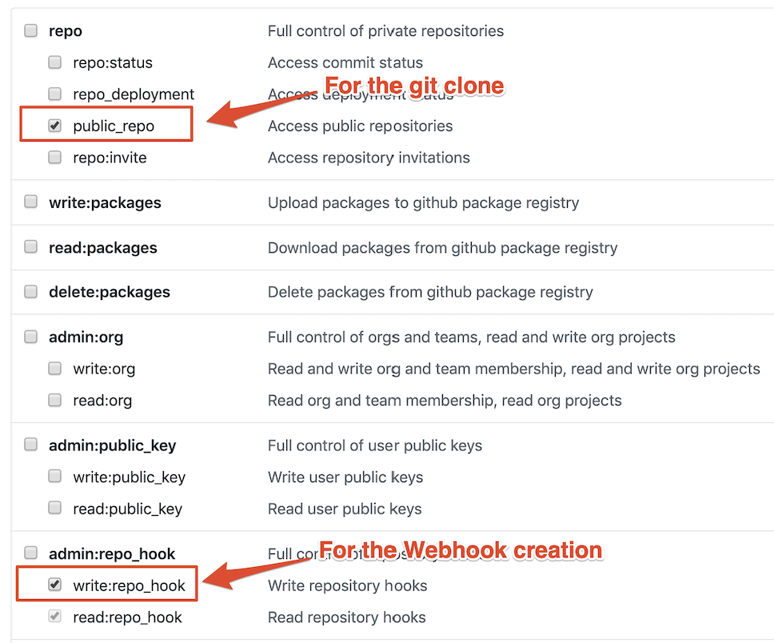

# Cloud Native Toolkit Deployment Guides

This is demo gitops git repository for IBM Cloud Paks.

This demo repo have a default selection to deploy IBM App Connect (ACE).

### Prerequisites
1. Install the OpenShift CLI `oc`, [download latest oc](https://mirror.openshift.com/pub/openshift-v4/clients/crc/latest/) version 4.7 or 4.8
1. Install [kubeseal](https://github.com/bitnami-labs/sealed-secrets#homebrew) CLI
1. Create [Github](https://github.com) account
1. Install the Github `gh` CLI and login https://github.com/cli/cli
1. Create a new organization on github https://docs.github.com/en/organizations/collaborating-with-groups-in-organizations/creating-a-new-organization-from-scratch
1. Generate a [GitHub Personal Access Token (PAT)](https://docs.github.com/en/github/authenticating-to-github/keeping-your-account-and-data-secure/creating-a-personal-access-token) with the following scopes
    - [x] repo
    - [ ] admin:org
        - [x] read:org
    - [x] admin:repo_hook
    - [x] admin:org_hook

    <details>
    <summary> View screen capture of scopes required </summary>

    

    </details>


### Deploy the ACE operator and its pre-requisites
- Make sure you are logged in OpenShift with admin rights
    ```bash
    oc login ...
    ```

- Make sure you are connected to the correct OpenShift cluster
    ```bash
    oc whoami --show-console
    ```

- Log in with the Github CLI
    ```bash
    gh auth login
    ```

- Setup a local git directory to clone all the git repositories
    ```bash
    mkdir -p ace-production
    ```

- Download [sealed-secrets-ibm-demo-key.yaml](https://bit.ly/demo-sealed-master) and save in the default location `~/Downloads/sealed-secrets-ibm-demo-key.yaml`. You can override the location when running the script with `SEALED_SECRET_KEY_FILE`. Remember do not check this file to git.

- Run the bootstrap script, specify the git user `GIT_USER`, the git org `GIT_ORG`,the Github personal access token `GIT_TOKEN` and the output directory to clone all repos `OUTPUT_DIR`.You can use `DEBUG=true` for verbose output
    ```bash
    curl -sfL https://raw.githubusercontent.com/cloud-native-toolkit-demos/multi-tenancy-gitops-ace/master/scripts/bootstrap.sh | \
    GIT_USER=$REPLACE_WITH_GIT_USER \
    GIT_ORG=$REPLACE_WITH_GIT_ORG \
    GIT_TOKEN=$REPLACE_WITH_GIT_TOKEN \
    OUTPUT_DIR=ace-production \
    sh
    ```

- You can open the output directory containing all the git repositories with VSCode
    ```bash
    code ace-production
    ```

- To extract the url and password you can use the following commands
    ```bash
    echo "The ArgoCD URL and admin password:"
    oc get route -n openshift-gitops openshift-gitops-cntk-server -o template --template='https://{{.spec.host}}'
    oc extract secrets/openshift-gitops-cntk-cluster --keys=admin.password -n openshift-gitops --to=-
    echo "----"
    echo "The Cloud Pak console and admin password"
    oc get route -n tools integration-navigator-pn -o template --template='https://{{.spec.host}}'
    oc extract -n ibm-common-services secrets/platform-auth-idp-credentials --keys=admin_username,admin_password --to=-
    ```


- The following git repositories will be fork into a new github organization
    - https://github.com/cloud-native-toolkit/multi-tenancy-gitops
    - https://github.com/cloud-native-toolkit/multi-tenancy-gitops-infra
    - https://github.com/cloud-native-toolkit/multi-tenancy-gitops-services
    - https://github.com/cloud-native-toolkit-demos/multi-tenancy-gitops-apps

### References
- This repository shows the reference architecture for gitops directory structure for more info https://cloudnativetoolkit.dev/adopting/use-cases/gitops/gitops-ibm-cloud-paks/

